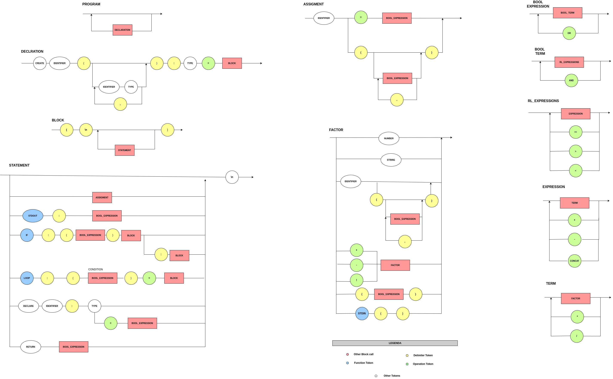

##  🐙️ TwoDots Language

Bem-vindo ao emocionante mundo da programação simplificada e intuitiva com a linguagem "TwoDots". 

Como o nome sugere, esta linguagem utiliza extensivamente o caractere ":" para melhorar a legibilidade e a eficiência do seu código. O "TwoDots" foi desenvolvido com o objetivo de tornar a codificação mais acessível e compreensível, especialmente para iniciantes na programação.

Linguagem que se inspira em várias linguagens de programação amplamente conhecidas, buscando incorporar as melhores características de cada uma, enquanto mantém um foco na simplicidade e legibilidade do código. 

Algumas linguagens que foram utilizadas de inspiração : Python , JavaScript , Java , C/C++/C#.

## 📌️ Examples of structures

#### Variable and Constants

```python
# Declarando variável
declare x : integer = 2
declare y : string = "y"
declare z : integer

```
#### Math operations
```python

declare x : integer = 2

x = x + 2 

```

#### Create and use function

```python

# Criando uma função
create function_name ( args ) : integer = {
  stdout : " Nothing here "
  return 0 
}

# Usando função
invoke : function_name()

# Pegando retorno da função
declare x : integer
x = invoke : function_name( args )

```

#### Conditional Block
```python

if : ( x == 2) = {
  # If block
  stdout : " X é igual a 2" 
} : {
  # Else block
  stdout : "X não é igual a 2"
} 

```

#### Loops

```python

declare i : integer = 0

loop : ( i < 5) = {
  i  = i + 1
}

```

#### Build-in function

```python

# Output
stdout  : "Display in screen"

# Input do teclado deve ser inteiro nesse exemplo
declare x : integer
x = stdin()

```

## 🎯️ EBNF

```mysql

PROGRAM                 = {STATEMENT}
STATEMENT               = "\n" , ASSIGMENT , STDOUT , STDIN , IF , LOOP , VARIABLES , CREATE , INVOKE

BOOL_EXPRESSION         = BOOL_TERM , { "or", BOOL_TERM } ;
BOOL_TERM               = RL_EXPRESSION , { "and", RL_EXPRESSION } ;
RL_EXPRESSION           = EXPRESSION, { ("==" | ">" | "<"), EXPRESSION } ;

EXPRESSION              = TERM, { ("+" | "-" | "."), TERM } ;
TERM                    = FACTOR , { ("*" | "/"), FACTOR } ;
FACTOR                  = Number | String | Identifier | (("+" | "-" | "!"), FACTOR) ;

STDOUT                  = "stdout" , ":" , BOOL_EXPRESSION
STDIN                   = "stdin"  , ":" , Identifier

ASSIGMENT               = Identifier , "=" , BOOL_EXPRESSION 
VARIABLES               = "declare" , "constant") , Identifier , ":" ,  ("integer" | "string") , (BOOL_EXPRESSION | λ)
IF                      = "if" , ":" , "(" , BOOL_EXPRESSION , ")" , "=" , BLOCK , ":" , "BLOCK"
LOOP                    = "loop" , ":" , "(" , BOOL_EXPRESSION , ")" , "=" , "{" , BLOCK , "}"
CREATE                  = "create" ,  string ,  "(" , args , ")" ,  ":" ,  ("integer" | "string") , "=" , FUNCTION_BLOCK
INVOKE                  = ( ("identifier" ,  "=") | λ) ,  "invoke" , ":" ,  string , "(" ,  "args" ,  ")"

BLOCK                   = "{" , STATEMENT ,  "}";
FUNCTION_BLOCK          = "{" , STATEMENT ,  "return" ,  "set@special_identifier" , "}";

Identifier              = Letter, { Letter | Digit | "_" } ;
Number                  = Digit, { Digit } ;
String                  = `"`, { λ | Letter | Digit }, `"` ;
Letter                  = ( a | ... | z | A | ... | Z ) ;
Digit                   = ( 1 | 2 | 3 | 4 | 5 | 6 | 7 | 8 | 9 | 0 ) ;

```

## 📊️ Diagram


