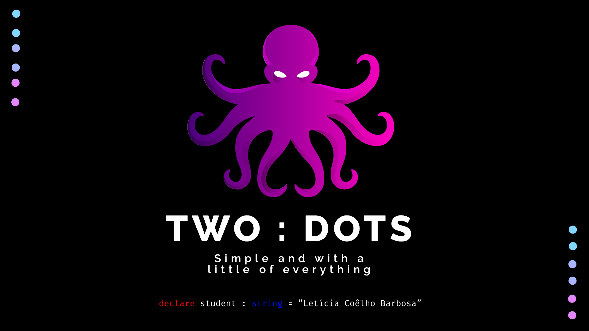
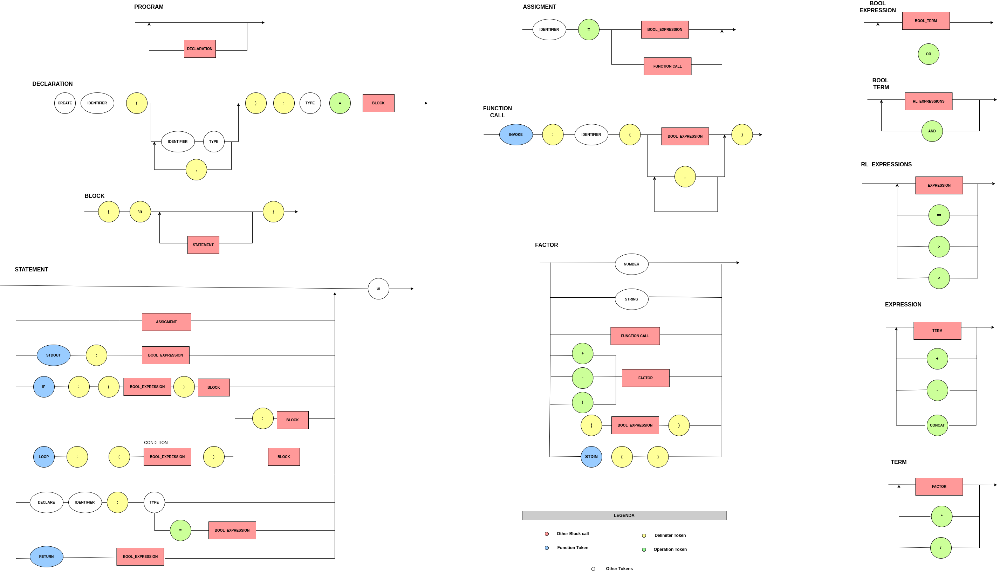

##  🐙️ TwoDots Language

Bem-vindo ao emocionante mundo da programação simplificada e intuitiva com a linguagem "TwoDots". 

Como o nome sugere, esta linguagem utiliza extensivamente o caractere ":" para melhorar a legibilidade e a eficiência do seu código. O "TwoDots" foi desenvolvido com o objetivo de tornar a codificação mais acessível e compreensível, especialmente para iniciantes na programação.

A "TwoDots" se inspira em várias outras linguagens amplamente reconhecidas, buscando incorporar as características que eu mais gosto de cada uma, enquanto mantém um foco na simplicidade e legibilidade do código. 

Algumas linguagens que foram utilizadas de inspiração : Python , JavaScript , Java , C/C++/C#.

<div align = "center">
    
</div>

## 📌️ Exemplos de uso

#### Variable and Constants

```python
# Comentário aqui
create main() : integer = {
    declare x : integer = 2
    declare y : string
    y = "y"
}
```
#### Math operations
```python
create main() : integer = {
    declare x : integer
    x = 2 * 2 / 2 - 2       # x = 0
}
```

#### Create and use function

```python
create soma ( x : integer , y : integer ) : integer = {
  return x + y
}

create main() : integer = {

    declare x : integer = 2
    declare y : integer = 4

    declare z : integer
    z = invoke : soma(x,y)

    stdout : z       # z = 6
}

```

#### Conditional Block
```python
create main() : integer = {
    declare x : integer = 2
    if : ( x == 2) = {
      stdout : "Deve printar" 
    } : {
      stdout : "Não deve printar"
    }
}
```

#### Loops

```python
create main() : integer = {
    declare i : integer = 0

    loop : ( i < 5) {
      i  = i + 1
      stdout : i
    }
}
```

#### Build-in function

```python

# Output
stdout  : "Display in screen"

# Input
declare x : integer
x = stdin()

```

## ⚙️ Como utilizar

1. **Flex-Bison**

Na pasta `FlexBison` é possível encontrar um arquivo `makefile` que permitirá a verificação da linguagem do arquivo `input.td`.

Para rodar, siga as instruções a seguir:

```bash
# Apaga arquivo anteriormente gerados 
$ make clean 

# Compilação
$ make

# Passa para o executavel o arquivo input.td
$ make execute
```

2. **Interpreter**

O arquivo`run_compiler.sh` realiza os testes do compilador (pasta `compiler`) passando como input os arquivos escritos na linguagem TwoDots (pasta `scripts`).

Garanta que o arquivo `run_compiler.sh` é um executável.

```bash
# Torna o arquivo executável
$ chmod +x run_compiler.sh
```

Para rodar, siga as instruções a seguir:

```bash
# Input = test_function.td
$ ./run_compiler.sh test_function

# Input = test_if.td
$ ./run_compiler.sh test_if

# Input = test_loop.td
$ ./run_compiler.sh test_loop

# Input = test_stdout_stdin.td
$ ./run_compiler.sh test_in_out

# Caso deseje realizar todos os testes de uma vez, apenas execute:
$ ./run_compiler.sh
```

## 🧮️ Diagrama



## 🎯️ EBNF

```mysql

PROGRAM                 = { DECLARATION }
DECLARATION             = "create" , Identifier , args_declaration , ":" , types , "=" , BLOCK

types                   = ("string" | "integer")
args_declaration        = (  λ | Identifier , ":" , types , ","  args_declaration |  Identifier , ":" , types )

STATEMENT               = "\n" , ASSIGMENT , STDOUT , IF , LOOP , VARIABLES , RETURN 

ASSIGMENT               = Identifier |  Identifier "=" , (BOOL_EXPRESSION | PARSER_FUNC_CALL)
PARSER_FUNC_CALL        = "invoke" , ":" , Identifier , "(" , args_received , ")"

args_received           = (  λ | Identifier , ","  args_received |  Identifier )

STDOUT                  = "stdout" , ":" , BOOL_EXPRESSION
IF                      = "if" , ":" , "(" , BOOL_EXPRESSION , ")"  , BLOCK , ":" , BLOCK
LOOP                    = "loop" , ":" , "(" , BOOL_EXPRESSION , ")" , BLOCK
VARIABLES               = "declare" ,  Identifier , ":" ,  types , ( "=" , BOOL_EXPRESSION | λ)
RETURN                  = "return" , BOOL_EXPRESSION

BOOL_EXPRESSION         = BOOL_TERM , { "or", BOOL_TERM } ;
BOOL_TERM               = RL_EXPRESSION , { "and", RL_EXPRESSION } ;
RL_EXPRESSION           = EXPRESSION, { ("==" | ">" | "<"), EXPRESSION } ;

EXPRESSION              = TERM, { ("+" | "-" | "."), TERM } ;
TERM                    = FACTOR , { ("*" | "/"), FACTOR } ;
FACTOR                  = Number | String | Identifier | (("+" | "-" | "!"), FACTOR | "(" , BOOL_EXPRESSION, ")" | STDIN) ;
STDIN                   = "stdin"  , "(" , ")"

BLOCK                   = "{" , STATEMENT ,  "}";

Identifier              = Letter, { Letter | Digit | "_" } ;
Number                  = Digit, { Digit } ;
String                  = `"`, { λ | Letter | Digit }, `"` ;
Letter                  = ( a | ... | z | A | ... | Z ) ;
Digit                   = ( 1 | 2 | 3 | 4 | 5 | 6 | 7 | 8 | 9 | 0 ) ;

```
